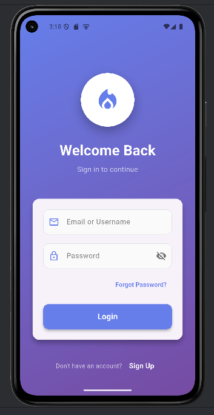
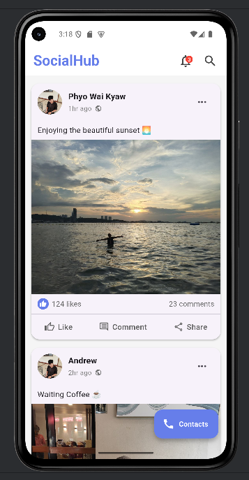
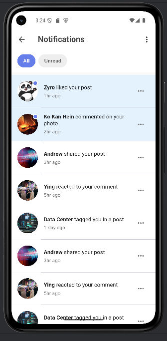
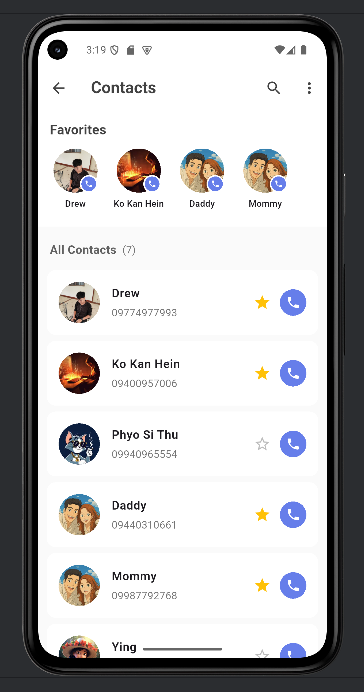
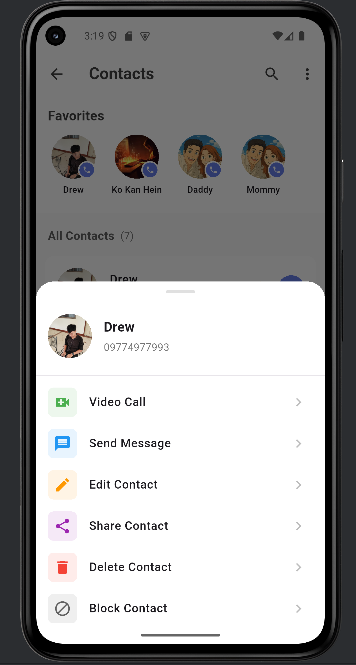

# SocialHub - Social Media App UI

A Flutter-based social media application UI that I built while learning Flutter development. This project showcases my understanding of Flutter widgets, navigation, and modern UI design principles.

## About This Project

I created this app as a learning project to practice:
- Building responsive UIs in Flutter
- Implementing navigation between screens
- Working with ListView and custom widgets
- Managing state with StatefulWidget
- Creating smooth animations and transitions

## What I Built

**Login Screen**
- Clean authentication UI with gradient background
- Form validation ready structure
- Password visibility toggle feature

**News Feed**
- Social media style post cards
- Interactive like, comment, and share buttons
- Dynamic feed layout

**Notifications**
- Notification list with read/unread states
- Clean categorization system

**Contacts**
- Phone contacts management
- Favorite contacts feature
- Direct calling integration using flutter_phone_direct_caller package

## Tech Stack

- Flutter & Dart
- Material Design widgets
- flutter_phone_direct_caller package

## How to Run

1. Make sure you have Flutter installed on your machine

2. Clone this repo
```bash
git clone [your-repo-url]
cd [project-folder]
```

3. Get dependencies
```bash
flutter pub get
```

4. Add images to the assets folder and update pubspec.yaml:
```yaml
flutter:
  assets:
    - assets/
```

5. Run the app
```bash
flutter run
```
```
## Screenshots

<p align="center">
  
  
  
  
  
</p>

## Project Structure

```
lib/
├── main.dart                  # Login screen
├── newfeed_testing.dart       # Main feed
├── notification_screen.dart   # Notifications
└── call4u.dart               # Contacts list
```

## What I Learned

Through this project, I gained hands-on experience with:
- Flutter widget composition and customization
- Navigation using Navigator.push/pushReplacement
- Working with ListView.builder for dynamic lists
- Implementing Material Design components
- Managing assets and images in Flutter
- Using third-party packages from pub.dev
- Creating responsive layouts

## Future Improvements

Things I plan to add:
- Backend integration with Firebase
- User authentication
- Post creation feature
- Comment functionality
- Dark mode support
- Profile page

## Notes

- This is a UI-focused project (no backend yet)
- Images need to be provided in the assets folder
- Phone calling requires proper permissions on actual devices

## Development Environment

- Flutter SDK 3.x
- Dart
- VS Code / Android Studio

---

Built with Flutter 💙

Feel free to check out the code and provide feedback!